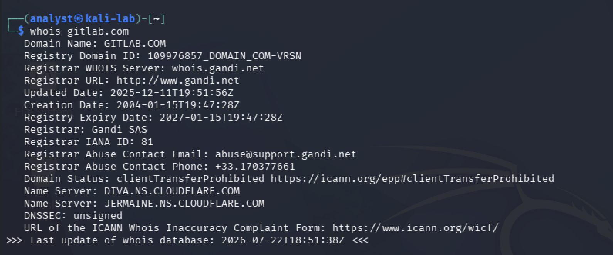
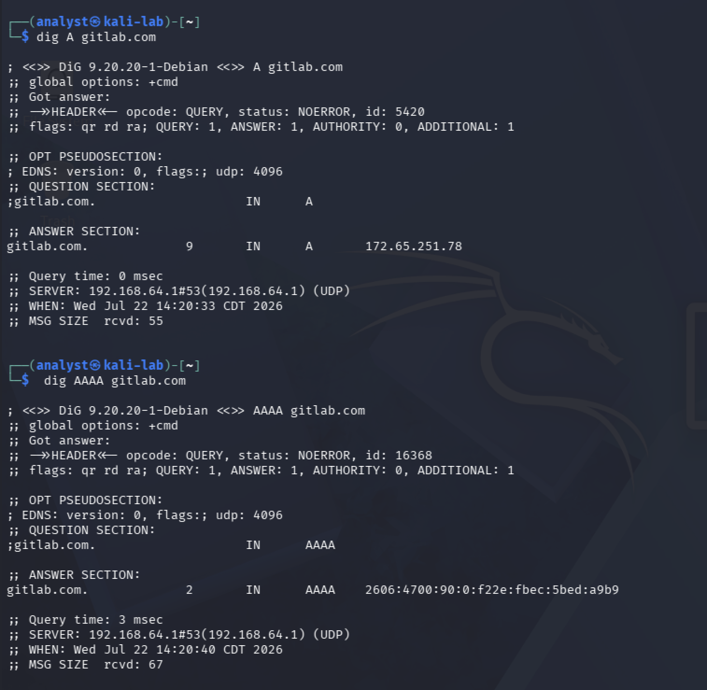
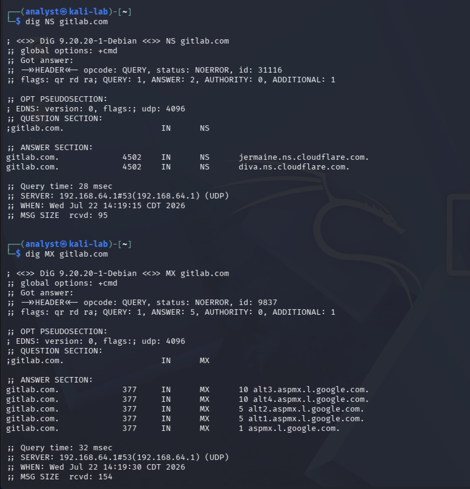
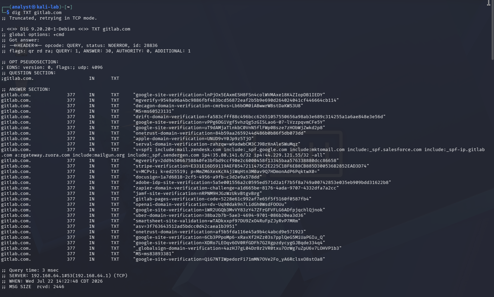
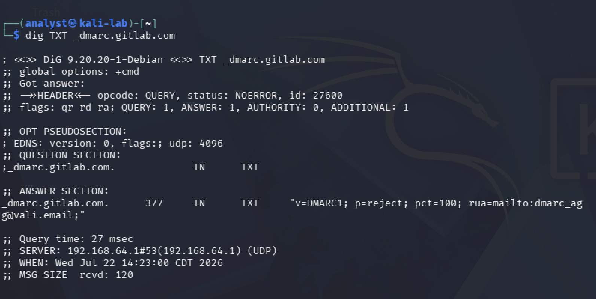

# Passive Open-Source Intelligence Assessment of GitLab

## Project Overview

This project documents a passive Open-Source Intelligence (OSINT) assessment of GitLab's publicly accessible digital footprint.

The objective of this assessment is to identify information that is publicly available about GitLab and evaluate how that information could assist an attacker during the reconnaissance phase of a cyber attack. At the same time, the assessment demonstrates how defenders can use the same intelligence to better understand and reduce their organization's attack surface.

Only passive collection techniques were used throughout this investigation. No active scanning, exploitation, authentication attempts, vulnerability testing, social engineering, or interaction with GitLab systems was performed.

---

## Objectives

- Identify GitLab's official public assets.
- Collect publicly available intelligence using passive OSINT techniques.
- Analyze how attackers could leverage publicly available information.
- Provide defensive recommendations based on the findings.

---

## Scope

### In Scope

- Official GitLab resources
- Public DNS records
- WHOIS records
- Certificate Transparency logs
- Public search engines
- Public OSINT platforms

### Out of Scope

- Port scanning
- Vulnerability scanning
- Brute-force attacks
- Exploitation
- Authentication testing
- Social engineering
- Contacting employees

---

# Investigation

## Phase 1 - Planning and Direction

### Assessment Objective

The objective of this assessment is to identify publicly available information about GitLab that could be leveraged during the reconnaissance phase of a cyber attack while demonstrating how passive OSINT techniques can help defenders understand and reduce an organization's public attack surface.

Before collecting intelligence, the target organization must first be verified to ensure that all information gathered throughout the investigation can be accurately attributed to GitLab.

--- 
# Phase 2 – Target Identification

### Assessment Question

What publicly available organizational information can be identified through GitLab's official website?

### Why This Matters

An organization's official website is often the first source consulted during passive reconnaissance. Reviewing official resources helps establish a trusted starting point for an investigation while identifying information the organization intentionally makes available to customers, partners, investors, researchers, and the public.

### Collection Method

The official GitLab website (`about.gitlab.com`) was reviewed using Firefox on host Mac browser. The **Company** navigation menu was explored to identify publicly available organizational resources, including company information, leadership pages, investor relations, and other corporate resources.

### Evidence

**Figure 1 – GitLab Company Navigation**


**Figure 2 – GitLab Executive Leadership**


**Figure 3 – GitLab Board of Directors**


### Findings

| Observation | Result |
|--------------|--------|
| Official Website | `about.gitlab.com` |
| Company Resources | Public access to company, careers, events, investor relations, trust center, handbook, and press resources |
| Executive Leadership | Executive leadership information is publicly available |
| Corporate Governance | Board of Directors information is publicly available |

### Why This Matters

Before collecting technical information about an organization, it is important to verify that the investigation is focused on official resources. Reviewing an organization's public website establishes a trusted starting point, confirms the target's identity, and identifies information the organization intentionally makes available to the public. This provides context for the remainder of the assessment and reduces the risk of relying on unofficial or inaccurate sources.

### Analysis

Reviewing GitLab's official website identified several publicly accessible organizational resources. The **Company** navigation menu provides direct access to information about the organization's leadership, governance, investor relations, trust center, handbook, and other corporate resources.

The Executive Leadership and Board of Directors pages provide publicly available information about GitLab's organizational structure, demonstrating a transparent corporate presence and establishing additional sources for passive intelligence collection.

### Analyst Assessment

GitLab maintains a comprehensive public-facing website that intentionally provides organizational and corporate information. From an OSINT perspective, these resources establish verified information about the company and its structure while illustrating the types of publicly available data that may be referenced during reconnaissance activities. All information was obtained from official public web pages.

---
# Phase 3 – Domain Registration Analysis

# Phase 3 – Domain Registration Analysis

### Assessment Question

What publicly available domain registration information can be identified for GitLab's primary domain?

---

### Why This Matters

WHOIS records provide publicly available registration information that helps analysts validate a domain's legitimacy and understand key aspects of its registration. Information such as the registrar, registration dates, domain status, and authoritative name servers establishes a foundation for investigating the domain's supporting infrastructure. Reviewing these records also helps ensure that subsequent DNS and infrastructure analysis is performed against the correct domain.

---

### Collection Method

A WHOIS lookup was performed against `gitlab.com` using the native `whois` utility in Kali Linux.

The following command was used:

```bash
whois gitlab.com
```

Only publicly available registration information was collected. No authentication attempts, service interaction, or active scanning was performed.

---

### Evidence

#### Figure 4 – WHOIS Results for `gitlab.com`

The WHOIS lookup identified publicly available registration information associated with GitLab's primary domain.



---

### Findings

| Observation | Result |
|--------------|--------|
| Domain Name | `gitlab.com` |
| Registrar | `Gandi SAS` |
| Creation Date | January 15, 2004 |
| Last Updated | December 11, 2025 |
| Registry Expiration Date | January 15, 2027 |
| Domain Status | `clientTransferProhibited` |
| Authoritative Name Servers | `diva.ns.cloudflare.com`<br>`jermaine.ns.cloudflare.com` |
| DNSSEC | Unsigned |

---

### Analysis

The WHOIS lookup confirmed publicly available registration information for GitLab's primary domain. The domain has been registered since **2004**, indicating a long-established public Internet presence. The registration is maintained through **Gandi SAS**, and the published domain status includes `clientTransferProhibited`, which helps protect against unauthorized domain transfers.

The WHOIS record also identified two authoritative name servers associated with the domain. These observations establish an initial understanding of GitLab's publicly available DNS infrastructure before performing direct DNS record analysis.

Additionally, the WHOIS record reports that DNSSEC is currently unsigned. This observation is documented as part of the publicly available registration information without drawing conclusions about the organization's security posture.

---

### Analyst Assessment

The WHOIS analysis established a verified registration baseline for GitLab's primary domain by identifying the registrar, registration history, domain status, and authoritative name servers.

These findings provide a foundation for the next phase of the assessment, where publicly available DNS records will be examined to validate the identified name servers and further analyze GitLab's external domain infrastructure.

# Phase 4 – DNS Infrastructure Analysis

### Assessment Question

What publicly available DNS information can be identified for GitLab's primary domain, and what does it reveal about the organization's publicly accessible infrastructure?

---

### Why This Matters

DNS records provide insight into how an organization's domain supports publicly accessible services such as web hosting, email delivery, and domain verification. Reviewing these records helps analysts identify important infrastructure components, understand how the domain is configured, and establish a technical baseline for later certificate transparency and public infrastructure analysis.

---

### Collection Method

DNS records for `gitlab.com` were queried using the `dig` utility in Kali Linux.

The following passive DNS queries were performed:

```bash
dig A gitlab.com

dig AAAA gitlab.com

dig NS gitlab.com

dig MX gitlab.com

dig TXT gitlab.com

dig TXT _dmarc.gitlab.com
```

Only passive DNS queries were performed. No port scanning, service enumeration, authentication attempts, or direct interaction with GitLab systems occurred during this phase.

---

### Evidence

#### Figure 5 – IPv4 and IPv6 DNS Records

The following DNS queries identified the IPv4 (`A`) and IPv6 (`AAAA`) address records currently published for `gitlab.com`.



---

#### Figure 6 – Name Server and Mail Exchange Records

The following DNS queries identified the authoritative name servers and mail exchange (MX) records associated with `gitlab.com`.



---

#### Figure 7 – TXT DNS Records

The following DNS query identified publicly available TXT records associated with `gitlab.com`, including domain verification records, email-related configuration, and other published DNS text records.



---

#### Figure 8 – DMARC DNS Record

The following DNS query identified the published DMARC policy associated with `gitlab.com`.



---

### Findings

| Observation | Result |
|--------------|--------|
| IPv4 Address Record | `172.65.251.78` |
| IPv6 Address Record | `2606:4700:90:0:f22e:fbec:5bed:a9b9` |
| Authoritative Name Servers | `jermaine.ns.cloudflare.com`<br>`diva.ns.cloudflare.com` |
| Mail Exchange Records | Five Google Workspace mail exchange records were identified. |
| TXT Records | Multiple TXT records were published, including SPF, domain verification, and service verification records. |
| DMARC Policy | A DMARC policy was published with `p=reject`, indicating that messages failing DMARC authentication should be rejected. |

---

### Analysis

The DNS analysis identified publicly available records supporting GitLab's primary domain, including address resolution, authoritative name servers, email routing, and email authentication policies.

The `A` and `AAAA` record lookups confirmed that GitLab publishes both IPv4 and IPv6 address records for its primary domain, enabling systems using either protocol to resolve the domain. The authoritative name servers identified through the DNS queries were consistent with those observed during the WHOIS analysis performed in the previous phase, providing corroborating evidence across two independent public data sources.

The MX records identified multiple Google Workspace mail exchange servers responsible for receiving email for the domain. Additionally, the published TXT records included SPF and numerous domain verification records associated with external services, demonstrating the use of DNS TXT records for email authentication and service ownership verification.

The published DMARC record specifies a policy of `p=reject`, indicating that emails failing DMARC authentication should be rejected. This publicly available policy demonstrates the implementation of an email authentication control intended to reduce domain spoofing and phishing attempts.

---

### Analyst Assessment

The DNS analysis established a technical baseline for GitLab's publicly observable domain infrastructure by identifying address records, authoritative name servers, mail routing, and email authentication configuration.

Correlating these DNS records with the WHOIS information collected during the previous phase increased confidence in the accuracy of the identified infrastructure and demonstrated consistency across multiple passive intelligence sources.

The findings from this phase provide the foundation for the next stage of the assessment, where certificate transparency logs and passive subdomain enumeration will be used to identify additional publicly observable GitLab assets.
