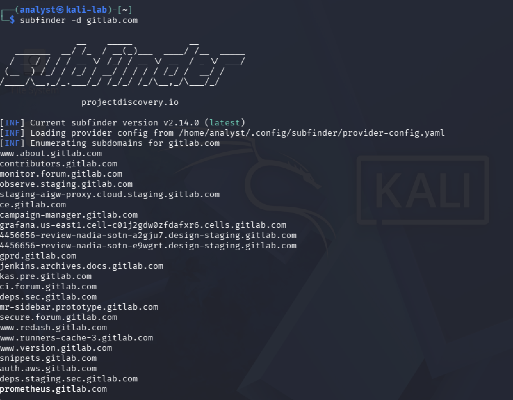
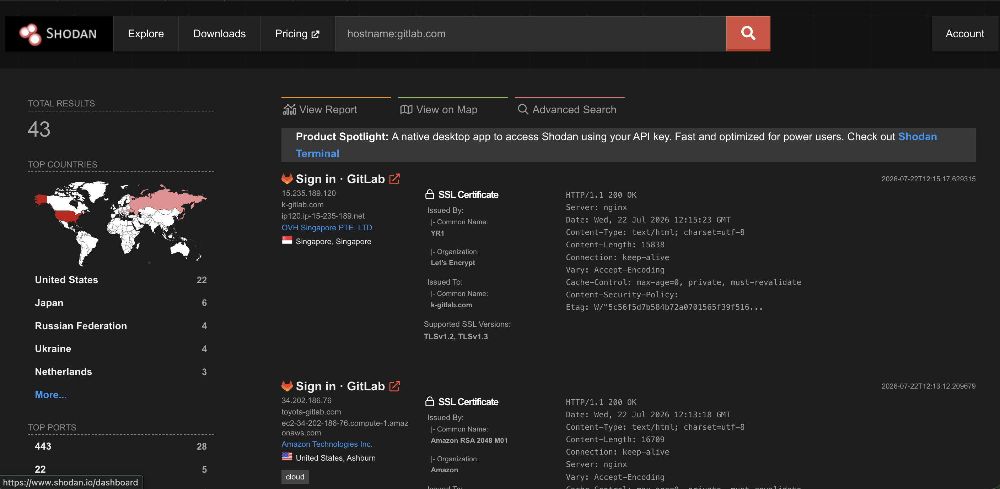
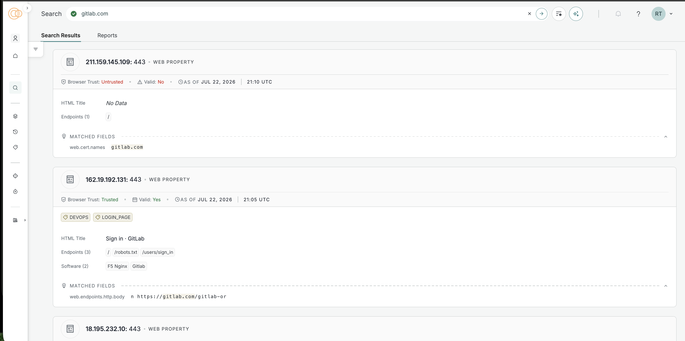

# Passive Open-Source Intelligence (OSINT) Assessment of GitLab

> **Project Summary**
>
> This project documents a passive Open-Source Intelligence (OSINT) assessment of GitLab's publicly observable Internet presence. Using only publicly available information, the assessment identifies organizational assets, domain registration details, DNS infrastructure, publicly discoverable subdomains, and Internet-facing systems while demonstrating how passive reconnaissance supports security operations, threat intelligence, and external attack surface awareness.

## Project Overview

This project documents a passive Open-Source Intelligence (OSINT) assessment of GitLab's publicly accessible digital footprint.

The objective of this assessment is to identify information that is publicly available about GitLab and evaluate how that information could assist an attacker during the reconnaissance phase of a cyber attack. At the same time, the assessment demonstrates how defenders can use the same intelligence to better understand and reduce their organization's attack surface.

Only passive collection techniques were used throughout this investigation. No active scanning, exploitation, authentication attempts, vulnerability testing, social engineering, or interaction with GitLab systems was performed.

---

## Objectives

- Identify GitLab's official public assets.
- Collect publicly available intelligence using passive OSINT techniques.
- Analyze how attackers could leverage publicly available information.
- Provide defensive recommendations based on the findings.

---

## Scope

### In Scope

- Official GitLab resources
- Public DNS records
- WHOIS records
- Certificate Transparency logs
- Public search engines
- Public OSINT platforms

### Out of Scope

- Port scanning
- Vulnerability scanning
- Brute-force attacks
- Exploitation
- Authentication testing
- Social engineering
- Contacting employees

---

# Methodology

This assessment followed a structured passive reconnaissance methodology designed to collect, validate, and analyze publicly available information without interacting directly with GitLab's infrastructure.

Information was gathered from official organizational resources, WHOIS records, public DNS data, passive subdomain enumeration, and Internet intelligence platforms. Each phase built upon the findings of the previous phase, allowing evidence to be validated across multiple independent sources and reducing reliance on any single dataset.

Throughout the assessment, no authentication, exploitation, vulnerability testing, active scanning, or social engineering activities were performed. All observations are based solely on publicly accessible information available at the time of the investigation.

---

# Investigation

# Phase 1 – Planning and Direction

## Assessment Question

How can a structured passive OSINT methodology be used to identify and validate GitLab's publicly observable Internet presence while maintaining a strictly passive approach?

---

## Why This Matters

Before collecting intelligence, it is important to establish a clear objective, define the scope of the assessment, and identify appropriate collection methods. A structured methodology ensures that information is gathered consistently, remains attributable to the intended target, and can be validated throughout the investigation using multiple independent sources.

Establishing these parameters also helps ensure the assessment remains ethical, repeatable, and limited to publicly available information.

---

## Collection Method

Before collecting technical information, the assessment scope, objectives, and passive collection techniques were defined.

The investigation was limited to publicly available information obtained from:

- GitLab's official website
- WHOIS records
- Public DNS records
- Passive subdomain enumeration
- Internet intelligence platforms

No active interaction with GitLab's infrastructure occurred during any phase of the assessment.

---

## Findings

| Observation | Result |
|--------------|--------|
| Assessment Type | Passive Open-Source Intelligence (OSINT) |
| Target Organization | GitLab |
| Collection Approach | Passive reconnaissance only |
| Active Interaction | None |
| Intended Outcome | Develop an evidence-based understanding of GitLab's publicly observable Internet presence |

---

## Analysis

Defining the scope and methodology before beginning reconnaissance establishes a structured foundation for the assessment. Limiting collection activities to passive intelligence sources ensures observations can be gathered without generating traffic toward the target while maintaining an ethical and repeatable investigation process.

This methodology also supports evidence validation by allowing information collected during later phases to be compared across multiple independent public sources.

---

## Attacker Perspective

Threat actors rarely begin an operation with exploitation. Instead, reconnaissance is used to understand the target, identify publicly available information, and build an inventory of Internet-facing assets before deciding whether additional activity is worthwhile.

The same structured approach benefits defenders by providing visibility into the information that is publicly accessible about their organization and identifying opportunities to improve external asset awareness.

---

## Analyst Assessment

A clearly defined methodology establishes the foundation for a reliable passive intelligence assessment. By limiting the investigation to publicly available information and validating findings throughout each phase, the assessment maintains both technical accuracy and ethical integrity while developing a comprehensive understanding of GitLab's publicly observable environment.

---
# Phase 2 – Target Identification

### Assessment Question

What publicly available organizational information can be identified through GitLab's official website?


---

### Why This Matters

An organization's official website is often the first source consulted during passive reconnaissance. Reviewing official resources helps establish a trusted starting point for an investigation while identifying information the organization intentionally makes available to customers, partners, investors, researchers, and the public.


---

### Collection Method

The official GitLab website (`about.gitlab.com`) was reviewed using Firefox on host Mac browser. The **Company** navigation menu was explored to identify publicly available organizational resources, including company information, leadership pages, investor relations, and other corporate resources.


---

### Evidence

**Figure 1 – GitLab Company Navigation**


**Figure 2 – GitLab Executive Leadership**


**Figure 3 – GitLab Board of Directors**


---

### Findings

| Observation | Result |
|--------------|--------|
| Official Website | `about.gitlab.com` |
| Company Resources | Public access to company, careers, events, investor relations, trust center, handbook, and press resources |
| Executive Leadership | Executive leadership information is publicly available |
| Corporate Governance | Board of Directors information is publicly available |


---

### Why This Matters

Before collecting technical information about an organization, it is important to verify that the investigation is focused on official resources. Reviewing an organization's public website establishes a trusted starting point, confirms the target's identity, and identifies information the organization intentionally makes available to the public. This provides context for the remainder of the assessment and reduces the risk of relying on unofficial or inaccurate sources.

---

## Attacker Perspective

Official organizational websites often serve as the first stage of reconnaissance because they provide verified information about a company's structure, leadership, products, services, and publicly available resources. This information helps attackers develop contextual awareness before expanding into technical reconnaissance such as DNS analysis, infrastructure discovery, and Internet intelligence collection.

Although this information is intentionally published, it contributes to an organization's publicly observable footprint and can assist in building a more complete profile of the target.

---

### Analysis

Reviewing GitLab's official website identified several publicly accessible organizational resources. The **Company** navigation menu provides direct access to information about the organization's leadership, governance, investor relations, trust center, handbook, and other corporate resources.

The Executive Leadership and Board of Directors pages provide publicly available information about GitLab's organizational structure, demonstrating a transparent corporate presence and establishing additional sources for passive intelligence collection.


---

### Analyst Assessment

GitLab maintains a comprehensive public-facing website that intentionally provides organizational and corporate information. From an OSINT perspective, these resources establish verified information about the company and its structure while illustrating the types of publicly available data that may be referenced during reconnaissance activities. All information was obtained from official public web pages.

---
# Phase 3 – Domain Registration Analysis

### Assessment Question

What publicly available domain registration information can be identified for GitLab's primary domain?


---

### Why This Matters

WHOIS records provide publicly available registration information that helps analysts validate a domain's legitimacy and understand key aspects of its registration. Information such as the registrar, registration dates, domain status, and authoritative name servers establishes a foundation for investigating the domain's supporting infrastructure. Reviewing these records also helps ensure that subsequent DNS and infrastructure analysis is performed against the correct domain.


---

### Collection Method

A WHOIS lookup was performed against `gitlab.com` using the native `whois` utility in Kali Linux.

The following command was used:

```bash
whois gitlab.com
```

Only publicly available registration information was collected. No authentication attempts, service interaction, or active scanning was performed.

---

### Evidence

#### Figure 4 – WHOIS Results for `gitlab.com`

The WHOIS lookup identified publicly available registration information associated with GitLab's primary domain.


---

### Findings

| Observation | Result |
|--------------|--------|
| Domain Name | `gitlab.com` |
| Registrar | `Gandi SAS` |
| Creation Date | January 15, 2004 |
| Last Updated | December 11, 2025 |
| Registry Expiration Date | January 15, 2027 |
| Domain Status | `clientTransferProhibited` |
| Authoritative Name Servers | `diva.ns.cloudflare.com`<br>`jermaine.ns.cloudflare.com` |
| DNSSEC | Unsigned |

---

### Threat Perspective

WHOIS information can help an attacker validate that a domain is legitimate and identify publicly available registration details such as the registrar, domain age, and authoritative name servers. While this information does not expose vulnerabilities, it can help an attacker distinguish legitimate organizational domains from lookalike or newly registered domains during the reconnaissance phase of an attack.

--- 

### Analysis

The WHOIS lookup confirmed publicly available registration information for GitLab's primary domain. The domain has been registered since **2004**, indicating a long-established public Internet presence. The registration is maintained through **Gandi SAS**, and the published domain status includes `clientTransferProhibited`, which helps protect against unauthorized domain transfers.

The WHOIS record also identified two authoritative name servers associated with the domain. These observations establish an initial understanding of GitLab's publicly available DNS infrastructure before performing direct DNS record analysis.

Additionally, the WHOIS record reports that DNSSEC is currently unsigned. This observation is documented as part of the publicly available registration information without drawing conclusions about the organization's security posture.


---

### Analyst Assessment

The WHOIS analysis established a verified registration baseline for GitLab's primary domain by identifying the registrar, registration history, domain status, and authoritative name servers.

These findings provide a foundation for the next phase of the assessment, where publicly available DNS records will be examined to validate the identified name servers and further analyze GitLab's external domain infrastructure.

---

# Phase 4 – DNS Infrastructure Analysis

### Assessment Question

What publicly available DNS information can be identified for GitLab's primary domain, and what does it reveal about the organization's publicly accessible infrastructure?

---

### Why This Matters

DNS records provide insight into how an organization's domain supports publicly accessible services such as web hosting, email delivery, and domain verification. Reviewing these records helps analysts identify important infrastructure components, understand how the domain is configured, and establish a technical baseline for later certificate transparency and public infrastructure analysis.

---

### Collection Method

DNS records for `gitlab.com` were queried using the `dig` utility in Kali Linux.

The following passive DNS queries were performed:

```bash
dig A gitlab.com

dig AAAA gitlab.com

dig NS gitlab.com

dig MX gitlab.com

dig TXT gitlab.com

dig TXT _dmarc.gitlab.com
```

Only passive DNS queries were performed. No port scanning, service enumeration, authentication attempts, or direct interaction with GitLab systems occurred during this phase.

---

### Evidence

#### Figure 5 – IPv4 and IPv6 DNS Records

The following DNS queries identified the IPv4 (`A`) and IPv6 (`AAAA`) address records currently published for `gitlab.com`.


**Key Observations**

- The `A` record resolves `gitlab.com` to the IPv4 address `172.65.251.78`.
- The `AAAA` record resolves `gitlab.com` to the IPv6 address `2606:4700:90:0:f22e:fbec:5bed:a9b9`.

**Why This Evidence Matters**

Identifying publicly advertised IP addresses establishes where the domain resolves on the Internet. These records provide a foundation for understanding the organization's external infrastructure and can later be correlated with certificate transparency logs and publicly indexed infrastructure identified through passive intelligence sources.

---

#### Figure 6 – Name Server and Mail Exchange Records

The following DNS queries identified the authoritative name servers and mail exchange (MX) records associated with `gitlab.com`.


**Key Observations**

- Two authoritative name servers were identified.
- Five mail exchange records were published for the domain.
- The authoritative name servers matched those identified during the WHOIS analysis.

**Why This Evidence Matters**

Authoritative name servers define which systems are responsible for the domain's DNS records, while MX records identify the infrastructure designated to receive email. Comparing these records with the WHOIS results also helps validate the consistency of publicly available registration and DNS information across multiple passive sources.

---

#### Figure 7 – TXT DNS Records

The following DNS query identified publicly available TXT records associated with `gitlab.com`.


**Key Observations**

- Multiple TXT records were identified.
- The records include SPF configuration.
- Several TXT records are used for domain verification.

**Why This Evidence Matters**

TXT records often contain information related to email authentication and domain ownership verification. Reviewing these records helps analysts understand how an organization publishes configuration information that supports email security and integration with external services.

---

#### Figure 8 – DMARC DNS Record

The following DNS query identified the published DMARC policy associated with `gitlab.com`.


**Key Observations**

- A DMARC policy is published.
- The policy is configured as `p=reject`.
- Aggregate reporting is enabled.

**Why This Evidence Matters**

DMARC records describe how an organization requests that receiving mail servers handle messages that fail email authentication checks. Reviewing the published policy provides insight into publicly available email authentication practices and demonstrates whether the organization has implemented a domain-level policy to help reduce email spoofing.

---

### Findings

| Observation | Result |
|--------------|--------|
| IPv4 Address Record | `172.65.251.78` |
| IPv6 Address Record | `2606:4700:90:0:f22e:fbec:5bed:a9b9` |
| Authoritative Name Servers | `jermaine.ns.cloudflare.com`<br>`diva.ns.cloudflare.com` |
| Mail Exchange Records | Five Google Workspace mail exchange records were identified. |
| TXT Records | Multiple TXT records were published, including SPF, domain verification, and service verification records. |
| DMARC Policy | A DMARC policy was published with `p=reject`, indicating that messages failing DMARC authentication should be rejected. |

---

### Threat Perspective

Public DNS records help map an organization's external infrastructure. Address records identify where a domain resolves, name server records identify the systems responsible for managing DNS, and mail-related records reveal publicly advertised email infrastructure. While these records are intended to be publicly accessible, they can assist attackers in understanding how an organization's services are exposed before conducting additional reconnaissance or attempting phishing, spoofing, or infrastructure-focused attacks.

---

### Analysis

The DNS analysis identified publicly available records supporting GitLab's primary domain, including address resolution, authoritative name servers, email routing, and email authentication policies.

The `A` and `AAAA` record lookups confirmed that GitLab publishes both IPv4 and IPv6 address records for its primary domain, enabling systems using either protocol to resolve the domain. The authoritative name servers identified through the DNS queries were consistent with those observed during the WHOIS analysis performed in the previous phase, providing corroborating evidence across two independent public data sources.

The MX records identified multiple Google Workspace mail exchange servers responsible for receiving email for the domain. Additionally, the published TXT records included SPF and numerous domain verification records associated with external services, demonstrating the use of DNS TXT records for email authentication and service ownership verification.

The published DMARC record specifies a policy of `p=reject`, indicating that emails failing DMARC authentication should be rejected. This publicly available policy demonstrates the implementation of an email authentication control intended to reduce domain spoofing and phishing attempts.

---

### Analyst Assessment

The DNS analysis established a technical baseline for GitLab's publicly observable domain infrastructure by identifying address records, authoritative name servers, mail routing, and email authentication configuration.

Correlating these DNS records with the WHOIS information collected during the previous phase increased confidence in the accuracy of the identified infrastructure and demonstrated consistency across multiple passive intelligence sources.

The findings from this phase provide the foundation for the next stage of the assessment, where certificate transparency logs and passive subdomain enumeration will be used to identify additional publicly observable GitLab assets.

--- 

# Phase 5 – Passive Subdomain Enumeration

## Assessment Question

What publicly available subdomains associated with GitLab can be identified through passive subdomain enumeration?

---

## Why This Matters

Subdomains often represent additional Internet-facing services that extend beyond an organization's primary website. Identifying these publicly accessible hostnames helps analysts develop a more complete understanding of an organization's external attack surface without directly interacting with its infrastructure.

Passive subdomain enumeration relies exclusively on publicly available information sources, making it suitable for reconnaissance activities while avoiding active scanning or direct engagement with the target environment.

---

## Collection Method

Passive subdomain enumeration was performed using **Subfinder**, an open-source passive reconnaissance tool that aggregates publicly available intelligence from multiple sources to identify subdomains associated with a target domain.

The following command was used:

```bash
subfinder -d gitlab.com
```

Only passive intelligence sources were queried during this phase. No DNS brute forcing, authentication attempts, vulnerability scanning, exploitation, or direct interaction with GitLab's infrastructure was performed.

---

## Evidence

### Figure 9 – Passive Subdomain Enumeration Results

Passive subdomain enumeration was performed using **Subfinder** to identify publicly available subdomains associated with GitLab.



### Key Observations

- Numerous GitLab-associated subdomains were identified.
- Hostnames supporting documentation, APIs, monitoring, package registries, analytics, and operational services were observed.
- Development and staging environments were also publicly discoverable through passive enumeration.

### Why This Evidence Matters

Publicly available subdomains expand an analyst's understanding of an organization's externally visible infrastructure. Identifying these assets helps establish a more complete inventory of Internet-facing services that can later be validated using independent passive intelligence sources.

---

## Findings

| Observation | Result |
|--------------|--------|
| Enumeration Method | Subfinder (Passive Mode) |
| Public Subdomains | Numerous GitLab-associated subdomains identified |
| Infrastructure Categories | Documentation, APIs, monitoring, registries, analytics, development, and staging services observed |
| Public Asset Discovery | Additional Internet-facing services identified beyond the primary domain |

---

## Analysis

Passive subdomain enumeration identified numerous publicly accessible hostnames associated with GitLab that were not immediately visible from the organization's primary website. The discovered subdomains represented a variety of organizational services, including documentation platforms, APIs, package registries, monitoring infrastructure, analytics services, and development environments.

Rather than indicating security weaknesses, these findings demonstrate how passive intelligence sources can reveal the breadth of an organization's externally visible infrastructure. Developing an inventory of these publicly observable assets provides a stronger foundation for validating Internet-facing services during the next phase of the assessment.

---

## Threat Perspective

Publicly discoverable subdomains can provide valuable reconnaissance information for attackers. Additional hostnames may reveal Internet-facing services, development environments, monitoring platforms, or specialized applications that are not immediately visible from an organization's primary website.

While the presence of a subdomain does not indicate a vulnerability, publicly available asset information contributes to an organization's observable attack surface and may assist attackers in prioritizing systems for further passive reconnaissance.

---

## Analyst Assessment

Passive subdomain enumeration expanded the assessment beyond GitLab's primary domain by identifying numerous publicly observable assets supporting a variety of organizational services. The results provide a broader understanding of GitLab's external presence while remaining entirely passive and non-intrusive.

These discovered hostnames establish a foundation for validating GitLab's publicly indexed infrastructure using Internet intelligence platforms during the next phase of the assessment. 

---

# Phase 6 – Public Infrastructure Validation

## Assessment Question

Can publicly indexed Internet intelligence platforms validate GitLab's publicly observable infrastructure and services identified during previous phases of the assessment?

---

## Why This Matters

Internet intelligence platforms continuously collect publicly observable information about Internet-facing systems, including hostnames, IP addresses, SSL/TLS certificates, exposed services, HTTP responses, and software fingerprints. Reviewing this information allows analysts to independently validate previously identified assets and develop greater confidence in the accuracy of passive reconnaissance findings without directly interacting with the target's infrastructure.

---

## Collection Method

Public infrastructure validation was performed using **Shodan** and **Censys**, two Internet intelligence platforms that continuously index publicly accessible Internet-facing systems.

The following searches were performed:

**Shodan**

```
hostname:gitlab.com
```

**Censys**

```
gitlab.com
```

Only publicly indexed information was reviewed during this phase. No authentication, vulnerability scanning, exploitation, or direct interaction with GitLab's infrastructure was performed.

---

## Evidence

### Figure 10 – Shodan Public Infrastructure Results

Shodan was used to review publicly indexed infrastructure associated with GitLab.



### Key Observations

- Shodan returned multiple GitLab-associated Internet-facing hosts.
- Indexed host information included IP addresses, SSL/TLS certificate details, HTTP response information, geographic location, and exposed services.
- HTTPS (TCP port 443) was the most commonly observed publicly indexed service.

---

### Figure 11 – Censys Public Infrastructure Results

Censys was used to review publicly indexed Internet-facing infrastructure associated with GitLab.



### Key Observations

- Multiple GitLab-associated web properties were identified.
- Indexed hosts included publicly accessible HTTPS services.
- Public records included IP addresses, SSL/TLS certificate information, software identification, and HTTP endpoint metadata.
- GitLab-related infrastructure aligned with assets identified during previous phases of the assessment.

---

## Findings

| Observation | Result |
|--------------|--------|
| Validation Platforms | Shodan and Censys |
| Public Infrastructure | Multiple GitLab-associated Internet-facing hosts identified |
| Indexed Metadata | IP addresses, HTTPS services, SSL/TLS certificates, HTTP response information, and software fingerprints observed |
| Intelligence Correlation | Infrastructure identified during WHOIS, DNS analysis, and passive subdomain enumeration was independently validated across multiple passive intelligence platforms |

---

## Analysis

Shodan and Censys independently validated infrastructure previously identified throughout the assessment. Both platforms indexed GitLab-associated Internet-facing systems and provided additional context including IP addresses, SSL/TLS certificate information, HTTP responses, software fingerprints, and publicly accessible services.

Rather than identifying entirely new infrastructure, this phase confirmed that GitLab's publicly observable assets are consistently represented across multiple independent intelligence platforms. Correlating these findings reduced reliance on any single data source and increased confidence in the overall assessment.

---

## Attacker Perspective

Internet intelligence platforms significantly reduce the effort required during the reconnaissance phase of an attack. Rather than manually identifying Internet-facing systems, an attacker can leverage platforms such as Shodan and Censys to quickly discover publicly indexed hosts, associated IP addresses, SSL/TLS certificates, software fingerprints, and exposed services.

For example, identifying publicly accessible HTTPS services, software technologies such as Nginx, or certificate metadata helps an attacker build a profile of an organization's external environment before conducting additional passive reconnaissance. While this information does not indicate the presence of vulnerabilities, it allows attackers to prioritize systems for further investigation and better understand an organization's publicly exposed infrastructure.

From a defensive perspective, organizations should regularly review how their infrastructure appears in Internet intelligence platforms to verify publicly exposed assets, identify unexpected systems, and maintain an accurate inventory of Internet-facing services.

---

## Analyst Assessment

Public infrastructure validation confirmed that GitLab's externally visible infrastructure is consistently represented across multiple independent passive intelligence platforms. Correlating Shodan and Censys with findings from WHOIS, DNS analysis, and passive subdomain enumeration strengthened confidence in the overall assessment and demonstrated the importance of validating intelligence through multiple publicly available sources.

This phase concludes the technical portion of the passive open-source intelligence assessment and establishes a comprehensive understanding of GitLab's publicly observable Internet presence. 

--- 
# Final Assessment

## Executive Summary

This passive open-source intelligence (OSINT) assessment examined GitLab's publicly observable Internet presence using only publicly available information. The assessment followed a structured methodology that combined organizational research, domain registration analysis, DNS enumeration, passive subdomain discovery, and public infrastructure validation to develop an evidence-based understanding of GitLab's external environment.

Throughout the assessment, findings were validated across multiple independent passive intelligence sources to improve confidence and reduce reliance on any single dataset. At no point was active scanning, authentication, exploitation, or direct interaction with GitLab's infrastructure performed.

---

## Key Findings

- GitLab publicly maintains organizational information through its official website, providing insight into leadership, governance, and corporate structure.

- WHOIS records identified publicly available domain registration information, including the registrar, registration history, domain status, and authoritative name servers.

- DNS analysis confirmed publicly advertised infrastructure, including IPv4 and IPv6 address records, authoritative name servers, mail exchange records, TXT records, and a published DMARC policy supporting email authentication.

- Passive subdomain enumeration identified numerous GitLab-associated hostnames supporting documentation, APIs, package registries, monitoring services, analytics platforms, development environments, and operational infrastructure.

- Public infrastructure validation using Shodan and Censys independently confirmed Internet-facing assets previously identified during DNS analysis and passive subdomain enumeration while providing additional metadata such as IP addresses, SSL/TLS certificates, HTTP services, and software fingerprints.

---

## Assessment Limitations

This assessment was intentionally limited to passive reconnaissance techniques using publicly available information. No active scanning, authentication attempts, exploitation, vulnerability testing, social engineering, or interaction with GitLab's infrastructure was performed.

As a result, this assessment cannot determine whether identified assets contain vulnerabilities, whether every publicly accessible asset was discovered, or whether all indexed information accurately reflects GitLab's current operational environment. Public intelligence platforms may also contain outdated or incomplete information depending on when the data was collected.

---

## Overall Analyst Assessment

This assessment successfully established a comprehensive baseline of GitLab's publicly observable Internet presence through the correlation of multiple independent passive intelligence sources. Information collected during organizational research, WHOIS analysis, DNS enumeration, passive subdomain discovery, and public infrastructure validation consistently supported one another, increasing confidence in the overall findings.

Rather than identifying security vulnerabilities, the assessment focused on understanding GitLab's externally visible infrastructure and demonstrating how publicly available information can be systematically collected, validated, and analyzed to build an accurate inventory of Internet-facing assets. This approach reflects how passive reconnaissance supports defensive security operations, threat intelligence, asset management, and incident response by providing organizations with greater visibility into their external attack surface.

---

## Conclusion

This assessment demonstrated how passive open-source intelligence can be used to systematically identify, validate, and analyze an organization's publicly observable Internet presence without directly interacting with its infrastructure. By correlating evidence across GitLab's official website, WHOIS records, DNS analysis, passive subdomain enumeration, and Internet intelligence platforms, a comprehensive view of GitLab's external environment was developed using only publicly available information.

The methodology applied throughout this project emphasizes evidence collection, validation across multiple independent sources, and objective analysis rather than simply gathering information. This structured approach reflects real-world security practices where accurate asset identification, analytical reasoning, and clear documentation are essential for understanding an organization's external exposure and supporting informed security decisions.
